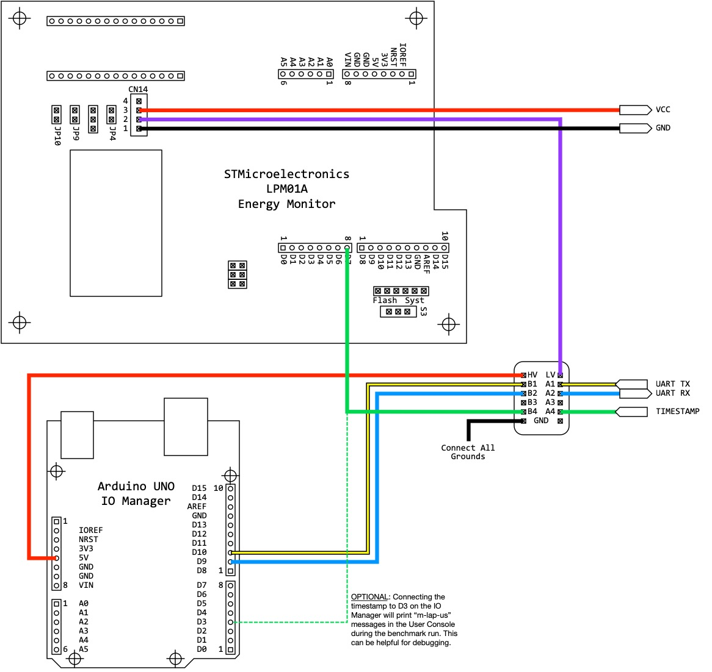
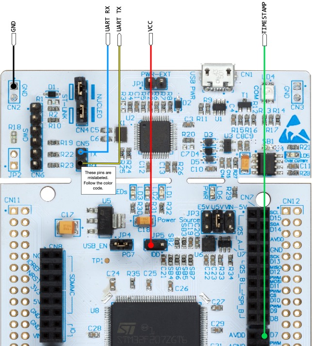

## Energy Mode Hardware (Duplicated from https://github.com/eembc/ulpmark-ml/blob/main/README.md)

Port the firmware to your device from the test harness based on the EEMBC ULPMark-ML [test harness sample code](https://github.com/eembc/testharness-ulpmark-ml), or the [MLCommons tinyMLPerf reference code](https://github.com/mlcommons/tiny/tree/master/v0.1). Both sample templates are un-implemented, but provide the same serial monitor interface.

Compile as `EE_CFG_ENERGY_MODE 1` (see the `#define` in `monitor/th_api/th_config.h` or `api/submitter_provided.h`). Program the `th_timestamp` to generate a falling edge on a GPIO that lasts at least one microsecond (hold time).

Since Energy Mode supplies power to the device at a different voltage than the host USB, we need to electrically isolate the DUT. This is accomplished through two pieces of hardware: 1) three level shifters (one each for UART-TX, UART-RX and GPIO timestamp), an Arduino Uno. The Uno is referred to as the "IO Manager" and provides a UART passthrough to/from the host Runner.

The IO Manager is a simple Arduino UNO. Using the Arduino IDE to flash the `io-manager_1.0.3.hex` image, like so:

~~~
C:\dev\arduino\1.6.6\hardware\tools\avr\bin\avrdude.exe -CC:\dev\arduino\1.6.6\hardware\tools\avr\etc\avrdude.conf -v -patmega328p -carduino -PCOM3 -b115200 -D -Uflash:w:io-manager_1.0.3.hex:i
~~~

The recommended level shifters are the 4-channel BSS138 devices, as sold by [AdaFruit](https://www.adafruit.com/product/757). Simply plug these into a breadboard, provide 5V on the high-side voltage from the Arduino, and VCC from another power supply. This LevelShifter VCC must match the GPIO output of the DUT.

The Runner supports three different energy monitors, aka *EMON*:

1. [STMicroelectronics LPM01A](https://www.st.com/en/evaluation-tools/x-nucleo-lpm01a.html), firmware version 1.0.6 or later required
2. [Joulescope JS110 plus a low-noise power supply](https://www.joulescope.com/products/joulescope-precision-dc-energy-analyzer)
3. [Keysight N6705](https://www.keysight.com/en/pd-2747858-pn-N6705C/dc-power-analyzer-modular-600-w-4-slots?cc=US&lc=eng) with 1xN6781+1xN6731 or 2xN6781

Depending on the EMON you use, there are three different Runner schematics.

Below, the LPM01A provides two supplies: measured VOUT (CN14.3) and *un-*measured VDD (CN14.2). VOUT is used to power the device under test only, whereas VDD provides the low-voltage supply to the level shifters because VDD=VOUT. The high-side of the level shifter is provided by the Arduino UNO, which is 5V. This allows the DUT to run at 1.8V to 3.3V, and still be able to talk to the Arduino at 5V. Since low-voltage is supplied by the un-measured source, it does not count toward the joules used by the DUT.

The yellow line is the output of the DUT UART (Tx), which goes into the Arduino UNO Rx. Likewise, the blue line out of the Arduino UNO transmits to the DUT Rx through the level shifter. Same goes for the timestamp. While the source code claims it needs to be an open-drain, push-pull will work as well, since the level shifter essentially converts open drain to push pull. Pin D7 of the LPM01A listens for falling edges and logs a timestamp.

Below we see the connectivity to the reference platform, the Nulceo L4R5ZI, which uses the Nucleo 144 board schematic. Remove the IDD jumper and connect VCC to the left side. The UART pins on the ST-LINK header are the default mbed-os UARTTX and UARTRX pins. (Note: the labels don't quite make sense, as RX is connected to UARTTX, and vice versa for TX.) The timestamp should be a `DigitalOut`, and D7 is common for all mbed-os boards that support the Arduino interface. Lastly, there are many grounds on the board, pick one.

For debug purposes, the timestamp can also be sent to the Arduino D3 pin. This will cause additional timestamp information to be printed in the log as `io: m-lap-us-\d+`. This can be helpful if there are timestamp issues.

If you do not have firmware version 1.0.6 on your LPM01A (it prints the version on the LCD while booting), you can [download it here](https://www.st.com/content/st_com/en/products/development-tools/software-development-tools/stm32-software-development-tools/stm32-utilities/stm32-lpm01-xn.html). It requires the ST CubeMXDeFuse application as well to perform the upgrade (see [instructions](https://www.st.com/resource/en/user_manual/dm00418905-getting-started-with-powershield-firmware-stmicroelectronics.pdf) that come with the firmware).

For the JS110, [use this schematic](img/hookup-js110.png), and for the N6705, [this one](img/hookup-n6705.png). The concept is the same, the only differences are in where the VOUT and VDD are sourced, and how the timestamp is routed. For the N6705, the timestamp is split into the Arduion UNO. This is done because the N6705 cannot generate it's own timestamps; instead it is synched to the UNO which provides them. For the LPM01A & JS110, the timestamp doesn't need to be connected to the UNO, but it can be to help provide additional debug info (as the UNO will announce it saw a timestamp, which can be helpful if your EMON doesn't seem to be listening).

**IMPORTANT NOTE: Only ONE power supply is allowed to supply the DUT during measurement.** Any additional circuitry on the board will contribute to power and lower the score. The run rules allow cutting traces, desoldering bridges, removing jumpers or setting switches to disable ancillary hardware on the platform (e.g., debug hardware, or kit sensors).

To assist in making the setup more compact, EEMBC provides a link to an [Arduino shield](https://www.eembc.org/iotmark/index.php#framework) for faster connectivity.

See the "Bill of Materials" section at the end of this file for more information on where to buy all the parts shown above.

For first-time setup, it really helps to have a small logic analyzer or a digital oscilloscope to help trace the output of the DUT at various stages of the isolation path. For example, is the Rx transmission from the host making it to the UART input? Is the boot message from the DUT coming from the right TX pin on the header? Is the timestamp held low long enough?