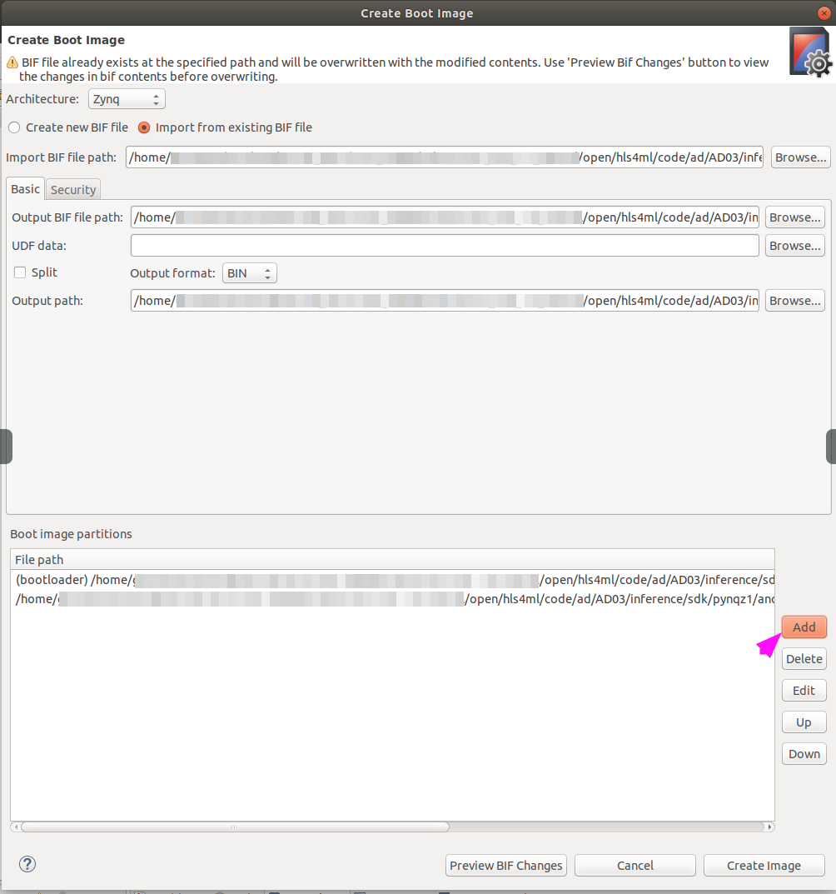

# Boot from Flash

- In the SDK, select `anomaly_detector_fsbl` in _Project Explorer_
- Click: `Xilinx >> Create Boot Image`
- Click: `Add`

- Select: `anomaly_detector_standalone`

- Click: `Create Image`
- Click: `Xilinx >> Program Flash`
- Click: `Image File:` - `Browse`

- Select: `BOOT.bin` (check the full path at the top of the following image)

- Click: `Ok`
- Select: `anomaly_detector_fsbl.elf`

- Click: `Ok`
- **Make sure that the jumper on the board is on QSPI**
- Click: `Program`
